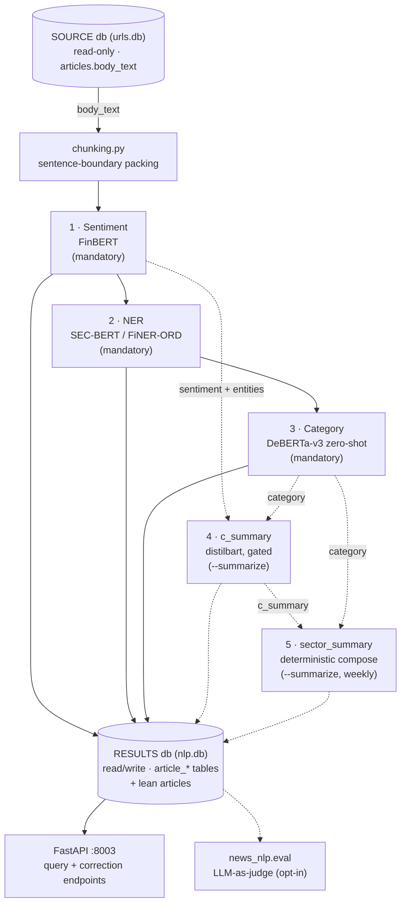

# SPEC.md — `portfolio-nlp`

Part of the thesis *"Sistema inteligente para la optimización de la inversión
en portafolios mediante integración de información financiera estructurada y
no estructurada de acciones del S&P500"* — Gabriel Jaime Múnera González &
Dovaribi Carupia Yagari, Universidad Pontificia Bolivariana (UPB). Referred
to elsewhere in this document and the architecture artifacts by its working
nickname, "Portfolio Thesis."

The technical contract for this repository: requirements, architecture, data
model, and acceptance criteria. Where `.specify/memory/constitution.md` is
the philosophy/principles/code-style layer this repo commits to regardless of
feature, this document is the "what, precisely" layer for the system it
implements — every requirement below should be traceable to a test, and every
design decision should be explainable by a principle in the constitution.
Link liberally: a design choice justified by, e.g., the constitution's
Architecture or Security & Data principles is annotated `(constitution: …)`
below rather than re-argued here.

Requirement IDs (`FR-0xx` functional, `NR-0xx` non-functional) are stable —
don't renumber an existing one, even if it's later superseded; mark it
superseded in place instead. Reference them in commits/PRs/tests
(`test_two_tier.py::test_source_readonly  # FR-007`) so a reviewer can trace
implementation back to requirement and requirement back to test.

---

## 1. Overview & Purpose

`portfolio-nlp` is the semantic layer of a six-repository system (the
"Portfolio Thesis") that builds and maintains an S&P 500 portfolio on top of
a knowledge graph. Data flows in one direction through the system:

```
sources (Wikipedia/news/Finnhub/SEC EDGAR)
  → portfolio-data-mining      (acquisition: discovers URLs, extracts article text)
  → portfolio-nlp              (THIS REPO — semantic layer)
  → portfolio-financial-analysis (fundamentals/pricing/cycle/quant → SEMANTIC score input)
  → portfolio-knowledge-graph   (RDF/OWL projection + SPARQL evidence surface)
  → portfolio-reports           (as-of run engine, per-name evidence, HTML report)
  → portfolio-app                (thin Streamlit client)
```

with one feedback edge running back up (a user-defined decision criterion,
compiled once in `reports` and propagated into `financial-analysis` and the
knowledge graph) — out of scope for this repo, noted here only for context.

**What this repo is for**: raw news article text is not usable as a
portfolio-decision input on its own. `portfolio-nlp` turns
`articles.body_text` (owned and crawled by `portfolio-data-mining`) into
structured, per-article and per-sector-week signals — sentiment, named
entities, a fixed-taxonomy category, and opt-in summaries — with per-row
model provenance (`model_name`, `processed_at`) and a human-correction path,
so that everything downstream (today: `financial-analysis`'s SEMANTIC score;
designed but not yet built: the knowledge-graph's per-`(asset, day)`
aggregation) can treat the result tables as a stable, auditable contract
rather than re-deriving meaning from raw text itself.

**What this repo is explicitly not**: it does not discover URLs or crawl
pages (`portfolio-data-mining`'s job — this repo treats `articles` as
pre-populated, read-only input); it does not aggregate results across assets
or time into portfolio-level signals (`financial-analysis` and
`knowledge-graph`'s job); it makes no portfolio or trading decision.

## 2. Scope & Requirements

### 2.1 In scope

- Five batch NLP stages over pre-populated article text (sentiment, NER,
  category always run; per-article and per-sector-week summarization
  opt-in), each writing its own result table, idempotent and resumable.
- The two-tier SOURCE (read-only)/RESULTS (read-write) database contract.
- A FastAPI serving layer (query + human-correction endpoints) that works
  off the RESULTS store alone.
- An LLM-as-judge accuracy-evaluation subsystem (`news_nlp.eval`), opt-in at
  the dependency-group level.

### 2.2 Out of scope

- URL discovery / page crawling / article extraction (`portfolio-data-mining`).
- Cross-asset or cross-time aggregation of NLP output into a portfolio
  signal (`portfolio-financial-analysis`, `portfolio-knowledge-graph`).
- Any UI (`portfolio-app`) or report rendering (`portfolio-reports`).
- Training the four models from scratch (`train_ner.py` fine-tunes the NER
  head but is a standalone script, not part of the pipeline).

### 2.3 Functional requirements

| ID | Requirement | Acceptance criteria |
|---|---|---|
| **FR-001** | The sentiment stage runs `ProsusAI/finbert` over every pending article's `body_text` (chunked, token-weighted average across chunks) and writes exactly one `article_sentiment` row per article. | After a pipeline run, every article with SOURCE text has an `article_sentiment` row with `label ∈ {positive, negative, neutral}`, `score`/`positive`/`negative`/`neutral` ∈ `[0, 1]`, and `model_name`/`processed_at` populated. |
| **FR-002** | The NER stage runs `gamug/sec-bert-finer-ord-ner`, merges BIO-tagged sub-token predictions **word-boundary aware**, and writes one `article_entities` row per detected span with a char offset and confidence. | No emitted span starts or ends mid-word (regression test for the fixed "3"-as-`ORG` subword-fragmentation bug, `82c5e6a`); every row has `entity_type ∈ {PER, LOC, ORG}`, valid `start_char < end_char` into the source text, and a `score`. |
| **FR-003** | The category stage classifies each article via two-level hierarchical zero-shot NLI (`MoritzLaurer/deberta-v3-base-zeroshot-v2.0`) against the fixed taxonomy in `news_nlp.taxonomy` (3 groups → 9 leaf labels + `other`), on the title + lead chunk only, and writes one `article_category` row. | `label` is one of the 9 taxonomy slugs or `other`; `group_label`/`group_score` are populated even when `label = other`; all 9 raw NLI distribution columns are populated (audit trail for threshold retuning); `label = other` iff the winning slug's score is below `CATEGORY_CONFIDENCE_THRESHOLD`. |
| **FR-004** | The `c_summary` stage (opt-in, `--summarize`) generates one abstractive summary per article (`sshleifer/distilbart-cnn-12-6`, hierarchical reduce over chunks) **only** for articles that already have a sentiment row **and** at least one entity scoring `> 0.8`, writing `article_summary`. | A normal (non-`--summarize`) pipeline run leaves `article_summary` untouched; an article failing the gate never gets a row even under `--summarize`; `num_chunks ≥ 1`. |
| **FR-005** | The `sector_summary` stage (opt-in) composes one row per `(gics_sector, gics_sub_industry, week_start)` for each **closed** calendar week, deterministically concatenating member companies' `c_summary` text attributed by ticker, with the only model-generated text being a stats-only intro sentence. | `build_sector_intro_seed`'s model input never contains a ticker, company name, or summary text (unit-testable — cross-company blending is structurally impossible, not just avoided); `UNIQUE(gics_sector, gics_sub_industry, week_start)` holds; `facts_json` carries the structured (non-narrative) aggregate. |
| **FR-006** | Every stage is idempotent and resumable: it processes only rows missing from its own result table (or below `format_version`/needing a schema migration self-heal for `sector_summary`/`eval_run`/`article_category`). | Running the pipeline twice on unchanged input produces no duplicate or changed rows; a `sector_summary` row below `SECTOR_SUMMARY_FORMAT_VERSION` regenerates via `INSERT OR REPLACE` on the next run with no separate backfill script. |
| **FR-007** | The pipeline reads article text from a read-only-ATTACHed SOURCE store and writes results (plus a lean `articles` row per touched article) to a separate RESULTS store; SOURCE is never written. | `db.require_source_text` raises before any model loads if SOURCE is unset or has no usable `body_text` (constitution: Security & Data #2); a write attempt against schema `source` is not exercised by any code path (`grep` for `source\.` write statements returns none outside read paths). |
| **FR-008** | A FastAPI service (`apps/news_nlp_api.py`, `:8003`) exposes pipeline trigger/status, article/category/entity/sentiment read + stats endpoints, `sector_summary` retrieval, the latest eval summary, and human-correction `PATCH`/`DELETE` endpoints for sentiment/entities/category — all working off the RESULTS store alone. | `GET /articles/{id}`, `/stats/*`, `/sectors/summary`, `/eval/latest` all return `200` with only `$DATABASE_URL` configured (no `$SOURCE_DATABASE_URL`) once a pipeline run has already populated RESULTS. |
| **FR-009** | A human can correct a stage's output (`news_nlp.corrections`: `update_*`/`delete_*` for sentiment, entity, category) and that correction survives a subsequent pipeline run on the same article. | After `update_category` changes a label and a pipeline rerun completes, the row's `label` is unchanged (the article is no longer "pending" for that stage — `fetch_pending_category_articles` selects on row absence, not staleness); `delete_category` makes the article eligible for reprocessing again. |
| **FR-010** | `news_nlp.eval` samples processed articles per stage, gets an LLM-as-judge verdict per sampled row, and records both an `eval_run` summary (aggregate metrics, MLflow run ID) and per-row `eval_judgement` rows. | `uv run cli/news_nlp_eval.py --stage <s> --sample-size N` completes without GPU or a labelled corpus, produces exactly one new `eval_run` row with `status = ok` and `metrics_json` populated, `N` (or fewer, if population is smaller) `eval_judgement` rows, and one MLflow run under `news_nlp_eval/<stage>`. |

### 2.4 Non-functional requirements

| ID | Requirement | Acceptance criteria |
|---|---|---|
| **NR-001** | Only one model is resident on the accelerator at a time; a stage with nothing pending never loads its model. | Manual/profiled check: peak process VRAM during a single-stage run stays within a 6 GB budget; a pipeline run with zero pending rows for a stage shows no corresponding model-load log line. |
| **NR-002** | Every stage produces *correct* output on CPU, not just on GPU (`DEVICE` falls back to CPU when CUDA is unavailable). | `uv run pytest` (hermetic, monkeypatched models, no GPU) is green on a CPU-only CI runner — the actual gate today; a slower non-hermetic full-model CPU smoke run is out of scope for CI. |
| **NR-003** | The test suite requires no network access and no GPU. | `.github/workflows/ci.yml`'s `pytest -q` job passes on `ubuntu-latest` with no GPU and no outbound calls beyond `uv sync`. |
| **NR-004** | Chunking must handle articles far past a model's token limit (observed up to ~13K words) without silent truncation. | A synthetic long-body fixture (well past 512 tokens) processes through sentiment/NER/category with `chunking.py` producing sentence-boundary-packed chunks and no unrecorded truncation. |
| **NR-005** | Heavy/optional dependencies (`strands-agents`, `mlflow`) never load unless the caller actually invokes evaluation. | `import pipeline` / `import apps.news_nlp_api` succeeds in an environment with only the base `[project]` dependencies installed (no `eval` group) — `news_nlp.eval.run_eval` is imported lazily. |
| **NR-006** | A DB-engine change (away from SQLite) must not require touching this repo's stage/query logic — only a `portfolio-common` version bump. | `grep -rn "import sqlite3" src apps cli` returns nothing; every engine-specific SQL fragment goes through `conn.dialect` / `portfolio_common.db` helpers. |

## 3. Technology Stack & Architecture Decisions

Full stack and rationale: `.specify/memory/constitution.md` §Technological
stock. Summary for traceability:

- **Runtime**: Python `>=3.12,<3.13`, `uv`-managed (`uv.lock` committed).
- **ML/NLP**: PyTorch (`cu124` wheel pin) + `transformers` for all four
  models — chosen because every model ships as a `transformers` checkpoint;
  a different framework would mean re-hosting each one.
- **Serving**: FastAPI + `uvicorn`, `pydantic` request/response models.
- **Storage**: SQLite, accessed exclusively through `portfolio_common.db`'s
  `Dialect`/`TwoTierDatabase` seam (git-tag-pinned `portfolio-common`) — no
  raw `sqlite3` anywhere in `src`/`apps`/`cli` (NR-006).
- **Evaluation** (opt-in group): `strands-agents[openai]` (the judge LLM
  client) + `mlflow` (run tracking).

Architecture decisions this repo has already made and should not be
re-litigated without a constitution amendment:

- **The DB layer is vendored, not a dependency.** `src/news_nlp/` owns
  schema/queries/corrections/taxonomy directly; `portfolio_common` supplies
  only the engine-agnostic `Database`/`Dialect`/`Allowlist` primitives
  underneath it. (History: this code moved out to `portfolio_common.news_nlp`
  and back once already — see `docs/portfolio-common-v1-migration-plan.md`.)
- **Two physical databases, not one.** SOURCE (`urls.db`, the crawler's
  full corpus, has `body_text`) and RESULTS (`nlp.db`, a lean serving store)
  stay physically separate by design (constitution: Architecture #3) — not a
  migration debt to collapse.
- **Stage stack is a fixed pipeline, not a DAG/orchestrator.** Five stages
  run in a fixed order (`run_pipeline`, `src/pipeline.py`) inside one
  process; no task queue, no distributed execution. Justified by corpus
  scale and the "one model resident at a time" VRAM constraint (NR-001).

## 4. System Architecture



**Reading this diagram**: solid arrows are the mandatory chain every
downstream consumer can rely on (stages 1–3, always run); dashed arrows are
the opt-in path (stages 4–5, only under `--summarize`) and the evaluation
subsystem (runs independently, off the same RESULTS store). `run_pipeline`
(`src/pipeline.py`) executes stages 1→2→3 unconditionally, then 4→5 only if
`summarize=True`, inside one process/one connection, `ATTACH`ing SOURCE
read-only and detaching it in a `finally` block.

Full detail, with hover tooltips per component: [the repository
artifact](https://claude.ai/code/artifact/65e62819-28dd-495b-b6ec-64f9c1751235)
referenced from `CLAUDE.md`. System-level placement of this repo among the
other five: [the architecture
overview](https://claude.ai/code/artifact/d3865a63-2894-4e20-b38a-7e50cf0d4040).

## 5. Data Model

Canonical DDL: `src/news_nlp/schema.py` (`build_schema`). All five result
tables key off `article_id INTEGER REFERENCES articles(id)`; `articles`
itself is **not** created by this repo (SOURCE owns the full row with
`body_text`; RESULTS holds a lean, `body_text`-free subset populated
row-by-row on first result write for that article).

### SOURCE `articles` schema contract

What each stage actually reads from SOURCE, and what `require_source_text`
does (and does not) verify before a run — pulled from
`src/news_nlp/sector_summary/queries.py` and `news_nlp.db`, not assumed:

| Column | Read by | Checked by `require_source_text`? | Behavior if missing/NULL |
|---|---|---|---|
| `id` | every stage (join/FK target) | implicitly (primary key) | — |
| `body_text` | stages 1–4 (sentiment/NER/category/`c_summary`) | ✅ yes — the run aborts if the column is absent or every row is empty/blank (FR-007) | pipeline never starts |
| `ticker`, `company` | stage 5 (`sector_summary`, per-company attribution) | ❌ no | attribution text for that company is whatever the column holds, including `NULL` |
| `gics_sector`, `gics_sub_industry` | stage 5 (buckets articles into `(sector, sub_industry, week)` groups) | ❌ no | a row with either `NULL` is **silently excluded** from every `sector_summary` bucket (`WHERE a.gics_sector IS NOT NULL AND a.gics_sub_industry IS NOT NULL`) — no error, no log line |
| `pub_date` | stage 5 (week-bucketing key) | ❌ no | falls back to `fetched_at` when `NULL` (`COALESCE(a.pub_date, a.fetched_at)`) — not a hard requirement |
| `fetched_at` | stage 5 (fallback only) | ❌ no | only consulted when `pub_date` is `NULL` |

**Only `body_text` is a validated contract.** Everything `sector_summary`
depends on is assumed, not checked — a SOURCE missing `gics_sector`/
`gics_sub_industry` doesn't fail the run, it just quietly produces a smaller
(or empty) `sector_summary` for that period (§13, open question 3).

| Table | Key | Notable columns | Written by |
|---|---|---|---|
| `article_sentiment` | `article_id` (PK) | `label`, `score`, `positive`/`negative`/`neutral`, `model_name`, `processed_at` | Stage 1 |
| `article_entities` | `id` (PK, autoincrement) | `article_id` (FK, indexed), `entity_type` (`PER`/`LOC`/`ORG`), `text`, `start_char`/`end_char`, `score` | Stage 2 |
| `article_category` | `article_id` (PK) | `label` (9 slugs or `other`), `score`, `group_label`/`group_score` (level-1 hierarchy), 9 raw per-slug NLI scores (audit trail) | Stage 3 |
| `article_summary` | `article_id` (PK) | `summary_text`, `num_chunks`, `model_name`, `processed_at` | Stage 4 (opt-in) |
| `sector_summary` | `id` (PK); `UNIQUE(gics_sector, gics_sub_industry, week_start)` | `summary_text`, `facts_json` (structured, non-narrative), `intro_text` (the one model-generated sentence), `format_version` (self-heal marker), `num_articles`/`num_companies` | Stage 5 (opt-in) |
| `eval_run` | `id` (PK) | `stage`, `sample_size`, `judge_model`/`judge_url`, `code_version`, `mlflow_run_id`, `metrics_json`, `strata_json`, `status` | `news_nlp.eval` |
| `eval_judgement` | `id` (PK) | `run_id` (FK), `article_id` (not FK-constrained — snapshot semantics), `bucket`, `verdict_json`, `correct`, `severity`, `rationale` | `news_nlp.eval` |

**Category taxonomy** (`news_nlp.taxonomy`): 3 top-level groups →
`corporate_actions`, and others documented in `docs/category-taxonomy.md` →
9 leaf slugs total, classified in two NLI passes (level-1 group, then level-2
leaf within the article's top-2 groups) against a calibrated confidence
threshold (`CATEGORY_CONFIDENCE_THRESHOLD`, currently 0.6 — see §13 for the
calibration history); anything below threshold at the leaf level resolves to
`other`.

**Relationships**: every result table's `article_id`/`article_id`-derived FK
points at RESULTS' lean `articles(id)` copy, not directly at SOURCE — a
result row is valid even after SOURCE is detached or rotated. `eval_run` →
`eval_judgement` is a real FK (a run's judgements die with the run); neither
references `articles(id)` (a judged sample is a point-in-time snapshot; the
underlying row may be corrected or reprocessed afterward — see FR-009/010).

Full topology (SOURCE vs. RESULTS, connection lifecycle, env vars):
`docs/db-topology.md`.

## 6. Core Workflows

**Batch pipeline run** (`cli/news_nlp_cli.py` → `pipeline.run_pipeline`):

1. Open RESULTS (`$DATABASE_URL`/`--results-db`), `ATTACH` SOURCE
   (`$SOURCE_DATABASE_URL`/`--source-db`) read-only.
2. `init_schema` (create-if-missing + additive migrations), then
   `require_source_text` — fail fast if SOURCE has no usable text.
3. Run sentiment → NER → category, each bounded by `--limit` if given, each
   skipping rows already present in its result table.
4. If `--summarize`: run `c_summary` (gated per-article), then
   `sector_summary` (closed weeks only).
5. Detach SOURCE, close the connection, print completion.

**Serving/query** (FastAPI, no SOURCE needed): a request opens a RESULTS-only
connection (`db.connect`, no `ATTACH`), reads/writes the result tables
directly. `POST /pipeline/run` kicks off an async pipeline run and
`GET /pipeline/status` polls an in-process progress tracker (not persisted
across process restarts).

**Human correction**: a caller `PATCH`es a sentiment/entity/category
endpoint → `news_nlp.corrections.update_*` (Allowlist-checked field names,
`processed_at` refreshed) or `DELETE`s it → the article becomes "pending"
again for that stage's next pipeline run (FR-009).

**Accuracy evaluation** (`cli/news_nlp_eval.py`, separate from the batch
pipeline, needs `$LLM_API_KEY`/`$LLM_MODEL`/`$LLM_URL`): sample
already-processed rows per stage (stratified — a low-confidence bucket plus
a representative random bucket, see `docs/evaluation.md`), send each to the
judge LLM, record `eval_run`/`eval_judgement`, log to MLflow.
`--check-regression` compares against a prior run's `metrics_json` and can
fail the invocation (used as a manual/scheduled gate, not part of `ci.yml`).

## 7. Business Logic & Algorithms

- **Sentiment**: FinBERT scored per chunk, aggregated as a token-weighted
  average across the *entire* `body_text` (not just a lead chunk) — a
  deliberate choice, unlike category (see below); the judge is scoped the
  same way as of the 2026-09-08 fix (`docs/evaluation.md`).
- **NER**: BIO-tag merge is **word-boundary aware**
  (`merge_bio_predictions`, fixed `82c5e6a`) — sub-token predictions are
  merged only within a single source word, so a numeral or partial token
  can no longer be emitted as a standalone entity.
- **Category**: two-level hierarchical zero-shot NLI — level 1 scores 3
  group hypotheses, level 2 scores only the leaf labels under the article's
  top-2 groups (6 of 9 candidates, not all 9) against
  `CATEGORY_PREMISE_MAX_TOKENS`-bounded title+lead-chunk premises. Chosen
  over a flat 9-way pass because it raised true-positive recall on
  under-served labels (`product_innovation`,
  `partnerships_business_dev`, `leadership_governance`) at an accepted cost
  in false-`other` reduction — see the calibration trade-off recorded in
  `news_nlp/taxonomy.py` and `docs/category-taxonomy.md`.
- **`c_summary` gating**: only articles with a sentiment row **and** an
  entity scoring `> 0.8` are summarized — a deliberate precision-over-recall
  filter (constitution: AI behavior #4, "decision-support not authoritative
  claims" — don't summarize what the pipeline itself is unsure contains a
  notable entity).
- **`sector_summary` composition is deterministic, not generative**, for
  everything except one intro sentence: `build_sector_facts` aggregates
  structured stats (`facts_json`); member companies' `c_summary` text is
  copied verbatim and ticker-attributed; the sole model call
  (`build_sector_intro_seed`) receives only aggregate statistics — no
  ticker, company name, or summary text ever reaches it, making
  cross-company blending structurally impossible rather than merely
  policy (FR-005).
- **Self-healing schema drift**: `sector_summary.format_version`,
  `eval_run.strata_json`'s additive migration, and `article_category`'s
  `group_label`/`group_score` additive migration all follow the same
  pattern — `Database.ensure_columns` (no-op if already current), with
  `sector_summary` additionally treating any row below the current
  `SECTOR_SUMMARY_FORMAT_VERSION` as stale and regenerating it via
  `INSERT OR REPLACE` on next run (no separate backfill script; contrast
  `article_category`'s additive-only migration, which does **not**
  auto-reprocess legacy rows — see §13).

## 8. Error Handling & Resilience

Governing principle: **fail loudly, never swallow silently**
(constitution: Security & Data #2). Concretely in this repo:

- `require_source_text` raises `RuntimeError` **before any model loads** if
  SOURCE is unset, unreachable, or has no non-empty `body_text` — the
  common misconfiguration (pointing a text stage at the results store) is
  caught immediately, not after minutes of model loading.
- No stage function catches and discards a model-inference exception to
  "keep the batch going" — a failure aborts the run rather than silently
  producing an incomplete or wrong result set. (There is currently no
  per-article try/except-and-skip in `pipeline.py`; a single malformed row
  failing a stage fails the whole run — see §13 for whether that's the
  right trade-off at scale.)
- `news_nlp.corrections`' `Allowlist.check()` raises `ValueError` on any
  field name outside a function's explicit allowed set — a caller cannot
  silently no-op or corrupt an unrelated column via a typo'd field name.
- `eval_run.status` is an explicit `running`/`ok`/`error` state machine with
  an `error` text column — an evaluation run that fails records *why*, it
  doesn't just vanish or leave a half-populated row masquerading as `ok`.
- The two-tier connection's `finally: db.detach_source(conn); conn.close()`
  guarantees SOURCE is detached and the connection released even when a
  stage raises mid-run.

## 9. Performance & Scalability Expectations

This repo has no throughput/latency SLA, and defining one is out of scope
(§14) — a real-time or high-volume performance target belongs to a
production system this project isn't. What exists instead is a documented
**accuracy baseline** from the first full-corpus evaluation run
(`docs/evaluation.md`, 2026-09-08, n=1000/stage) — treat a *drop* against
these as a regression signal, not the absolute numbers as a pass/fail bar:

| Stage | Headline metric | Baseline value |
|---|---|---|
| sentiment | `recall_negative`¹ | 0.62-0.78 across runs pre-entity-scoping (§13 item 1 — entity-scoped re-scoring implemented 2026-09-12, not yet re-measured; see `PLAN.md` Work item 4 / `TASKS.md` T-034) |
| category | `accuracy_vs_judge` | 0.487 post-hierarchical-fix + 0.6 threshold calibration (§13 item 2, resolved — was 0.69/0.47 pre-redesign) |
| ner | `micro_f1` | 0.858 (hallucination rate 16.0%) post-subword-fragmentation-fix, n=8000 against the T-025 resample pool (`PLAN.md` Work item 3, resolved 2026-09-12 — was 0.74/33.8% pre-fix, `TASKS.md` T-020; only the 19,988-article resample is post-fix, the remaining ~439K articles are not, `TASKS.md` T-022) |
| c_summary | `mean_faithfulness` | 4.87 / 5 (coverage weaker: 3.02 / 5, §13 item 10, active work — see `PLAN.md` Work item 6) |

¹ `docs/evaluation.md`'s "Why recall, not F1, for sentiment negative"
(2026-09-08) explains the switch from `macro_f1_vs_judge` (0.40 at the
original 2026-09-08 baseline, still logged every run) to `recall_negative`
as the metric `--check-regression` actually gates on.

Resource expectations that *are* enforced by design (NR-001, NR-004): single
model resident on the accelerator at a time (6 GB VRAM budget), chunked
processing for articles up to ~13K words. No articles/sec or API-latency
number is stated anywhere in this document — none has been measured, and
inventing one with no load test behind it would be worse than stating
plainly that none exists (§14).

## 10. Testing Strategy & Acceptance Criteria

- **Hermetic by construction** (NR-002/NR-003): `tests/news_nlp/conftest.py`
  builds a minimal `articles` table plus two-tier SOURCE/RESULTS fixtures;
  every model load is monkeypatched. No network, no GPU, no real HF
  download in `uv run pytest`.
- **Coverage mapping**: `test_schema.py`/`test_db.py`/`test_corrections.py`/
  `test_queries.py`/`test_sector_summary.py`/`test_env.py` are the vendored
  `news_nlp` package's own unit tests (FR-006/007/009); `test_two_tier.py`
  exercises the two-tier contract through `pipeline.run_pipeline` and the
  FastAPI app (FR-007/008); `test_eval_*.py` cover `news_nlp.eval` with the
  LLM and MLflow mocked (FR-010).
- **New requirement → new test first** (constitution: Quality & Testing
  #1) — a change implementing or altering an FR/NR above should land with a
  test that references the requirement ID in a comment or test name.
- **Coverage floor**: 80% on changed/new `src/` code per PR (constitution:
  Quality & Testing #3).
- **Acceptance criteria in §2.3/§2.4 are the test spec** — each row should
  be directly expressible as one or more `pytest` assertions; a PR claiming
  to satisfy an FR/NR without a corresponding test is incomplete.
- **Accuracy regression** (separate from `pytest`): `news_nlp_eval
  --check-regression` against the recorded baseline (§9) is a manual/
  scheduled gate today, not part of `ci.yml` — see §13 on wiring it in.

### Reproducing and validating the accuracy baseline

To re-check a stage against the §9 baseline after a model, prompt, or
threshold change (needs `$LLM_API_KEY`/`$LLM_MODEL`/`$LLM_URL`; no GPU
required — this reads already-stored predictions, it doesn't re-run the
pipeline):

```bash
# one stage
uv run cli/news_nlp_eval.py --stage sentiment --sample-size 100

# every stage the §9 baseline covers, failing if a headline metric dropped
# more than --regression-tolerance (default 0.05) vs. the previous MLflow run
uv run cli/news_nlp_eval.py --stage all --check-regression
```

`--check-regression` compares against **the previous MLflow run** under
`news_nlp_eval/<stage>` (`--regression-tolerance`, default `0.05`) — there is
no separate baseline file to maintain, and none should be invented; the
baseline of record is the run IDs already logged in `docs/evaluation.md`.
This remains a manually-invoked gate (§13, open question 8) — see that
section for the tradeoffs of wiring it into `ci.yml`.

## 11. Deployment Procedures

There is no formal CD pipeline for this repo yet; what exists:

1. `uv sync` (+ `uv sync --group eval` if evaluation is needed).
2. `uv run python -m setup` — pre-download the four HF model checkpoints
   (by name, not pinned commit SHA — see §13).
3. Configure `.env` (or real environment) with `$DATABASE_URL` /
   `$SOURCE_DATABASE_URL` (required for the text-reading stages; not
   required for serving/`sector_summary`-only use — `docs/db-topology.md`).
4. Run `uv run apps/news_nlp_api.py` (long-lived service, `:8003`) and/or
   invoke `uv run cli/news_nlp_cli.py` on whatever cadence the batch run
   needs (no scheduler is wired in today — see §13).
5. CI gate before merge (`.github/workflows/ci.yml`, `master`/PRs):
   `uv sync --group dev --group eval` → `ruff check` → `ruff format --check`
   → `mypy` → `pytest -q`. `.github/workflows/eval.yml` runs the real
   LLM-as-judge evaluation separately and does not block merges.

## 12. Dependencies & Integrations

- **Upstream (required)**: `portfolio-data-mining`'s `articles` table
  (SOURCE, via `$SOURCE_DATABASE_URL`) — this repo has no contract pinning
  its shape beyond `body_text` existing and being non-empty (FR-007); other
  columns (`gics_*`, `pub_date`, …) that the lean-copy and stages depend on
  are unpinned (§13).
- **Upstream (library)**: `portfolio-common`, git-tag-pinned in
  `pyproject.toml` (`[tool.uv.sources]`) — a DB-engine-contract change here
  is an explicit, reviewed re-pin, never a floating version.
- **Downstream (consumers, read-only via this repo's tables/API)**:
  `portfolio-financial-analysis` (SEMANTIC score input, today reads
  `article_sentiment`/`article_category` directly); `portfolio-knowledge-graph`
  (designed but not yet built: per-`(asset, day)` aggregation of the same
  tables).
- **External services**: Hugging Face Hub (model downloads, `setup.py`);
  an OpenAI-compatible LLM endpoint (`$LLM_API_KEY`/`$LLM_MODEL`/`$LLM_URL`,
  evaluation only); MLflow tracking (`$MLFLOW_TRACKING_URI`, local file
  store by default, evaluation only).
- **No dependency on**: any repo downstream of `financial-analysis`
  (`knowledge-graph`, `reports`, `app` never call into this repo directly).

## 13. Open Questions & Risks

Carried forward from the last recorded architecture review
([the repository artifact](https://claude.ai/code/artifact/65e62819-28dd-495b-b6ec-64f9c1751235))
and this document's own drafting — resolve or explicitly accept before
treating a related FR/NR as done:

1. **Sentiment is the weakest stage** (`macro_f1_vs_judge` 0.40): FinBERT's
   whole-article softmax average has no per-company or net-signal reasoning
   the judge applies (`docs/evaluation.md`'s 2026-09-08 follow-up). Flagged
   as a pipeline-level design question (entity-scoped sentiment?), not
   started. **Update (2026-09-12): promoted to active, priority work**,
   design chosen and implemented the same day — `PLAN.md` Work item 4 /
   `TASKS.md` T-030–T-034. The measurement side had already improved
   (text-scope fix, stratified sampling, `recall_negative` as headline
   metric — `docs/evaluation.md`'s 2026-09-08/09 follow-ups); the
   model-side gap described here is now **entity-scoped re-scoring**:
   `run_sentiment_stage` scores each sentence individually (not a
   ~510-token multi-sentence chunk — FinBERT was fine-tuned on
   sentence-level Financial PhraseBank, a real train/inference
   granularity mismatch confirmed against the real model) and weights
   sentences naming the article's own `company`/`ticker` over everything
   else, instead of a plain mean that gave a sentence about a *different*
   company the same say as one about the subject. **Not yet
   confirmed against real data or the LLM judge** — the latest measured
   pilot number (eval_run 18, n=800, `negative` precision 0.359) predates
   this change, and re-measuring it needs the project's real GPU/DB
   (`TASKS.md` T-034, same blocker as §13 item 11's T-062). Only a
   hermetic synthetic-fixture test confirms the mechanism works as
   intended so far.
2. **Four category leaf labels are near-guessing** (`product_innovation`
   0.14, `partnerships_business_dev` 0.16, `capital_shareholder_returns`
   0.20, `leadership_governance` 0.33 accuracy) even after the hierarchical
   redesign. `CATEGORY_CONFIDENCE_THRESHOLD` (0.6) is a reasoned but not
   fully validated calibration point (`news_nlp/taxonomy.py`).
   **Update (2026-09-12): resolved.** The 0.6 threshold calibration
   (`docs/evaluation.md`'s 2026-09-09 "Threshold calibration" follow-up,
   eval_run 19-21) took three of these four slugs to 0.61
   (`product_innovation`), 0.51 (`partnerships_business_dev`), and 0.53
   (`leadership_governance`) accuracy — the numbers above are stale,
   pre-calibration figures, kept here only as the historical record (see
   `PLAN.md` Work item 5). `capital_shareholder_returns` recall came in at
   0.293 (precision 0.074, a separate, not yet root-caused confusion with
   its own hierarchy group-mates) — still weak, but no longer
   near-guessing across the board. One related thread stays open:
   `other`'s own precision (0.474) — see `docs/evaluation.md`'s "The
   `other` bucket: a precision problem of its own" — tracked as
   `TASKS.md` T-041, low priority.
3. **No SOURCE `articles` contract beyond `body_text`.** Stages and the
   lean-copy depend on `gics_*`/`pub_date`/etc. existing with compatible
   types, but nothing pins or validates that shape (relates to FR-007).
4. **Model checkpoints are unpinned to a commit SHA** (`setup.py` fetches
   by repo name) — an upstream Hugging Face update can silently change
   results with no signal, undermining the accuracy baseline in §9.
5. ~~No throughput/latency SLA~~ — **retired, not an open question.** A
   throughput/latency SLA is a production requirement; this project doesn't
   have a production phase to require one for (§14). Kept here, struck
   through, only so the item number stays stable for anything that already
   references it.
6. **`article_category`'s additive schema migration does not
   auto-reprocess legacy rows** (unlike `sector_summary`'s
   `format_version` self-heal) — pre-hierarchical-classifier rows read back
   `group_label=''`/`group_score=0.0` and stay that way until a (not yet
   built) backfill runs.
7. **No scheduled cadence for `--summarize`** — stages 4–5 only populate on
   a manually-triggered run; `sector_summary`'s "closed week" semantics
   assume something runs at least weekly, but nothing enforces that.
8. **`--check-regression` isn't wired into `ci.yml`** — an accuracy
   regression can merge undetected; today's gate is a human remembering to
   run `news_nlp_eval` before/after a model or prompt change.
9. **Per-article failure isolation is unmodeled** (§8) — a single
   malformed row currently fails the whole batch run rather than being
   skipped-and-logged; unclear whether that's the intended trade-off at
   larger corpus sizes.
10. **`c_summary`'s `mean_coverage` is weak (3.02/5) despite the stage's
    strong headline metric** (`mean_faithfulness` 4.87/5,
    `pct_with_hallucination` 5.4%) — a terse/extractive tendency of
    `distilbart-cnn-12-6`, not a correctness problem
    (`docs/evaluation.md`'s 2026-09-08 baseline notes). `c_summary` is
    also, like NER, "suspected of the same full-article-vs-lead-cap
    [eval-sampling] mismatch... but this has not been empirically
    investigated." **Added 2026-09-12, active priority work** —
    `PLAN.md` Work item 6 / `TASKS.md` T-050–T-053. `sector_summary`
    itself stays out of scope for this item (and for eval generally):
    it's deterministic composition, only its `intro_text` sentence is
    generative. That sentence, though, runs through the exact same
    `SUMMARY_MODEL` and currently has **no evaluation at all**, not even
    a simple one — a gap in its own right, closed via a narrow
    faithfulness-only check (not a full new eval stage the size of
    `c_summary`'s) — `PLAN.md` Work item 6 step 4 / `TASKS.md`
    T-054–T-057.
11. **`run_ner_stage` has no batching** (`src/pipeline.py`) — one chunk
    through the model per forward pass, unlike `run_category_stage`
    (`CATEGORY_BATCH_SIZE=8` articles' premise/hypothesis pairs pooled
    into one call) and the summarization stages
    (`SUMMARY_BATCH_SIZE=4` via `hierarchical_summarize_batch`). Not a
    documented trade-off anywhere in the codebase — genuinely
    unaddressed, not a deliberate design choice. Measured impact: the
    2026-09-12 T-025 resample (`docs/evaluation.md`) processed 20,000
    articles unbatched in ~15 minutes (~22 articles/sec) on the project's
    GPU (6GB VRAM, well under budget the whole run) — a full-corpus
    backfill of the ~439,000 remaining pre-fix articles (§13 item 6's
    open T-022 question) would take roughly 5.5x that, over 5 hours,
    single-chunk-at-a-time, on hardware with headroom to go faster.
    **Batching implemented 2026-09-12** (`TASKS.md` T-060/T-061) — a new
    `NER_BATCH_SIZE` constant (starts at 8, `CATEGORY_BATCH_SIZE`'s value
    as a first guess) flattens every article's chunks in a batch into one
    padded tokenizer call + one forward pass (`pipeline._ner_batch`),
    regrouped back per article afterward; a parity test
    (`test_batched_and_per_article_ner_processing_produce_identical_entities`)
    confirms batched and one-article-at-a-time processing produce
    identical `article_entities`. **Still open**: T-062, empirically
    tuning `NER_BATCH_SIZE` against the 6GB VRAM budget and measuring the
    real throughput gain on a GPU — not done in this pass (no GPU access
    in the environment this shipped from); the starting value is
    untested against real hardware. `PLAN.md` Work item 7 has the full
    detail. (`run_sentiment_stage` has the identical unbatched shape and
    is likely worth the same treatment later, but is out of scope for
    this item — not raised here as its own numbered question to avoid
    scope creep beyond what was asked.)

## 14. Scope Boundaries (Out of Scope, Not Deferred)

**This repository is a thesis/research artifact. Productizing it is not a
goal of this project and no production phase is planned.** Every requirement
and acceptance criterion above (§2–§13) describes and governs that scope
honestly — nothing above should be read as an implicit production-readiness
claim. The items below are **permanently out of scope as this project is
currently defined**, not a backlog or a roadmap; they exist so a reader
doesn't mistake "not built" for "overlooked."

### What this stage validates

Per the §9 baseline and the design rationale in §7, this repo currently
validates:

- **Accuracy** of each NLP stage against an LLM-as-judge, not a hand-labelled
  gold set (`docs/evaluation.md` — treat the numbers as agreement-with-a-
  judge, not ground truth).
- **Feasibility** of the two-level hierarchical zero-shot classification
  approach for an imbalanced label set (§7 — the recall/false-`other`
  trade-off is measured, not assumed).
- **Structural correctness** of the deterministic `sector_summary`
  composition (§7, FR-005 — cross-company blending is structurally
  impossible, independently of accuracy).
- **Idempotency/resumability** of the batch pipeline (FR-006), exercised by
  the hermetic test suite (§10).

### What this project explicitly does not do (out of scope)

None of the following exist today, none are assumed by any FR/NR above, and
none are planned — this list is here so that absence reads as a deliberate
boundary of what this project is, not a gap someone forgot to close:

- **Access control**: there is no authentication or authorization on the
  FastAPI service (§4/FR-008) — every endpoint, including the correction
  `PATCH`/`DELETE` routes, is open to anyone who can reach `:8003`. Today
  that's acceptable only because the service is expected to run on a
  private/trusted network with a single operator, not because it's been
  assessed as safe for broader exposure.
- **Operational tooling**: no monitoring/alerting, no on-call runbook, no
  documented disaster-recovery procedure for either SQLite file, no
  scheduler for `--summarize` (relates to §13 item 7).
- **Throughput/latency SLAs and load testing** (§9) — a production
  requirement this project doesn't have; retired from §13 as item 5 rather
  than tracked as an open question, since there is nothing to resolve.
- **Model checkpoint pinning, formal data-retention policy, and a
  stability contract with downstream consumers** (`financial-analysis`) —
  today's floating HF checkpoints (§13 item 4) and unpinned `articles`
  schema (§13 item 3) are accepted risks at this scale, not oversights.

### §13 items: disposition

| §13 item | Disposition | Would only matter if |
|---|---|---|
| 1 — weak sentiment F1 | **Promoted to active work (2026-09-12)** — no longer treated as accepted; see `PLAN.md` Work item 4 | — (already in motion) |
| 2 — near-guessing category labels | **Resolved (2026-09-12)** — hierarchical redesign + 0.6 threshold calibration measured and shipped; `other`'s own precision is the one remaining low-priority thread (`PLAN.md` Work item 5) | — |
| 3 — no SOURCE schema contract beyond `body_text` | Accepted; §5's schema-contract table documents the actual (unenforced) dependency | `data-mining`'s `articles` shape changed under this repo |
| 4 — unpinned model checkpoints | Accepted for a single-operator, non-concurrent research setup | Exact reproducibility months later mattered more than it does today — worth pinning cheaply regardless (see below) |
| 5 — ~~no throughput/latency SLA~~ | Retired — a production requirement, and this project has no production phase | — |
| 6 — `article_category` migration doesn't auto-reprocess | Accepted; a manual backfill script is the fix if it's ever needed | Historical `group_label`/`group_score` accuracy mattered for a specific analysis |
| 7 — no scheduled `--summarize` cadence | Accepted; manual trigger is sufficient at current usage | This scope changed to need summaries reliably current on a cadence |
| 8 — `--check-regression` not wired into CI | Should fix regardless of scope — cheap, and protects the §9 baseline this spec treats as load-bearing | — |
| 9 — no per-article failure isolation | Accepted; corpus size and run frequency make a full-run failure low-cost today | Corpus size or run frequency made a single bad row expensive to fail on |
| 10 — weak `c_summary` coverage + unverified sampling scope | **Active priority work (added 2026-09-12)** — not accepted; see `PLAN.md` Work item 6 | — (already in motion) |
| 11 — `run_ner_stage` has no batching | **Active priority work (added 2026-09-12)** — not accepted; see `PLAN.md` Work item 7 | — (already in motion) |

Item 8 was the one item on this list originally flagged as worth doing
regardless of scope — a CI-plumbing change, not new infrastructure. Items 1
and 2 have since also moved off "permanent characteristic, not a queued
task": 2 is resolved and 1 is active priority work (see the update notes on
both items above and `PLAN.md` Work items 4-5). Items 10 and 11 are new,
added alongside items 1's and 2's status updates, and are also active
priority work (`PLAN.md` Work items 6 and 7 respectively). Items 3, 4 (the
pinning-reprocessing half), 5, 6, 7, and 9 remain permanent characteristics
of this project as scoped, not queued tasks.

## 15. Sign-off

This SPEC.md is the technical contract implementers, reviewers, and (per
`.specify/memory/constitution.md`'s AI behavior section) coding agents plan
against. A change that adds/removes a functional capability, alters an
acceptance criterion, or introduces a new external dependency should update
the relevant `FR-0xx`/`NR-0xx` entry (or add a new one) **in the same PR**
that implements it — not as a follow-up. A PR that contradicts this document
without amending it here first is out of spec; raise the conflict rather
than silently diverging (constitution: Governance).

| Role | Name | Date | Notes |
|---|---|---|---|
| Author | Gabriel Jaime Múnera González | | Universidad Pontificia Bolivariana (UPB) |
| Author | Dovaribi Carupia Yagari | | Universidad Pontificia Bolivariana (UPB) |
| Reviewer | Camilo Andrés Soto Montoya | | Universidad Pontificia Bolivariana (UPB) |

**Version**: 1.1.0 | **Last Amended**: 2026-09-12
